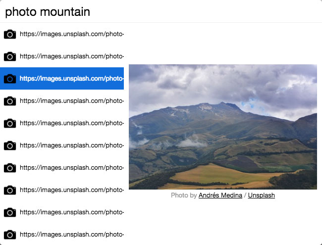

# cerebro-photos

> [Cerebro](http://www.cerebroapp.com) plugin to find photos using the [Unsplash](http://unsplash.com/) API.

## Usage

In Cerebro, type `photo something` or `something photo`, to find photos about your keyword.

Use <kbd>Cmd/Ctrl + C</kbd> to copy url of found photo to clipboard.

## Related

- [cerebro-gif](https://github.com/KELiON/cerebro-gif) - Originally forked from cerebro-gif
- [Cerebro](http://github.com/KELiON/cerebro) – main repo for Cerebro app;

## License

MIT © [Mat Munn](https://matmunn.me)
Thanks to [Alexandr Subbotin](http://asubbotin.ru)
